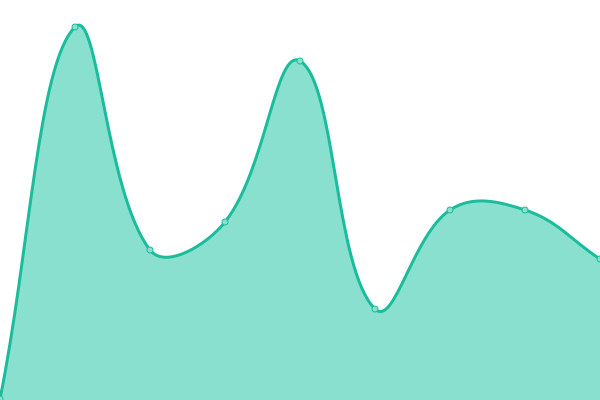

# [📈 Live Status](https://clamsnet.github.io/upptime-reports): <!--live status--> **🟩 All systems operational**

This repository contains the open-source uptime monitor and status page for [clamsnet](https://clamsnet.github.io/upptime-reports), powered by [Upptime](https://github.com/upptime/upptime).

With [Upptime](https://upptime.js.org), you can get your own unlimited and free uptime monitor and status page, powered entirely by a GitHub repository. We use [Issues](https://github.com/clamsnet/upptime-reports/issues) as incident reports, [Actions](https://github.com/clamsnet/upptime-reports/actions) as uptime monitors, and [Pages](https://clamsnet.github.io/upptime-reports) for the status page.

<!--start: status pages-->
<!-- This summary is generated by Upptime (https://github.com/upptime/upptime) -->
<!-- Do not edit this manually, your changes will be overwritten -->
<!-- prettier-ignore -->
| URL | Status | History | Response Time | Uptime |
| --- | ------ | ------- | ------------- | ------ |
|  [CLAMS Classic WebPac (Public Access Catalog)](https://library.clamsnet.org) | 🟩 Up | [clams-classic-web-pac-public-access-catalog.yml](https://github.com/clamsnet/upptime-reports/commits/HEAD/history/clams-classic-web-pac-public-access-catalog.yml) | 

 480ms
     
 | 

<a href="https://clamsnet.github.io/upptime-reports/history/clams-classic-web-pac-public-access-catalog">100.00%</a>
    

|  [CLAMS Encore Discovery Layer](54.85.49.242) | 🟩 Up | [clams-encore-discovery-layer.yml](https://github.com/clamsnet/upptime-reports/commits/HEAD/history/clams-encore-discovery-layer.yml) | 

 49ms
     
 | 

<a href="https://clamsnet.github.io/upptime-reports/history/clams-encore-discovery-layer">100.00%</a>
    

|  [CLAMS Sierra REST API](https://clamsnet.org/iii/sierra-api/about) | 🟩 Up | [clams-sierra-rest-api.yml](https://github.com/clamsnet/upptime-reports/commits/HEAD/history/clams-sierra-rest-api.yml) | 

 308ms
     
 | 

<a href="https://clamsnet.github.io/upptime-reports/history/clams-sierra-rest-api">100.00%</a>
    

|  [CLAMS Info Page](https://info.clamsnet.org) | 🟩 Up | [clams-info-page.yml](https://github.com/clamsnet/upptime-reports/commits/HEAD/history/clams-info-page.yml) | 

 2252ms
     
 | 

<a href="https://clamsnet.github.io/upptime-reports/history/clams-info-page">100.00%</a>
    

<!--end: status pages-->

[**Visit our status website →**](https://clamsnet.github.io/upptime-reports)

## 📄 License

- Powered by: [Upptime](https://github.com/upptime/upptime)
- Code: [MIT](./LICENSE) © [clamsnet](https://clamsnet.github.io/upptime-reports)
- Data in the `./history` directory: [Open Database License](https://opendatacommons.org/licenses/odbl/1-0/)
